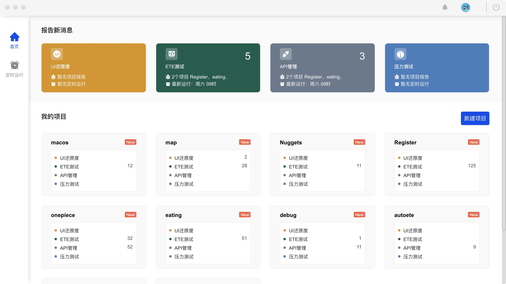

# eTest<small>V1.0.0</small>

> 一个简单易用的集成测试框架

-   **0 代码，自动化测试**
-   **完善的测试报告**
-   **强大的扩展能力**
-   **自动化运行定时任务以及测试结果推送机制**

👉👉👉 [下载](https://github.com/alltheblue/docs/releases)
👉👉👉 [Get Started](https://alltheblue.github.io/docs/#/application/example)

<!-- **一个集成 ui 还原测试、ete 页面测试、api 接口测试、压力测试的集成测试工具** -->

<!-- 

👉👉👉[立即体验🔗](https://alltheblue.github.io/docs/) -->

<!-- ### 下载

[立即体验下载](https://github.com/onepiece-smile/docs/releases)

### 开发的初衷

市面上的测试工具种类很多，很少有一个能同时满足 ui、ete、api、压力测试的测试工具；而且市面上的很多测试工具对测试人员都有一定的编码能力要求，导致很多测试人员对自动化测试望而却步；我们在思考，有没有方法可以实现，不需要测试人员编码，依旧可以实现的测试方式，而且可以同时集成的测试任务，自动化定时跑测试任务，生成测试报告并自动推送到测试开发人员手中，测试人员从此告别繁琐的且重复的测试操作，让测试变的有趣，真正提升测试人员的测试效率。

### 现状

1. 开发完成 ui 页面开发后，ui 需要多次介入与开发一起对静态页面的还原度校验，导致开发中沟通成本过高，压缩了开发人员开发其他项目的时间
2. 上线前没有 ui、ete、api、压力测试 测试报告，无法项目的稳定性评估
3. 每次上线后，测试需要对页面进行回归测试，每次上线回归测试都是对页面进行重复的操作，人为操作很容易遗漏到一些测试，出错率比较高
4. 线上的正式运行的项目，无法对接口、以及接口负载的稳定性作出实时评估

### 解决的痛点

1. 集成 UI 还原测试，ete 测试，api 接口测试，压力测试，所有测试任务在一个应用完成，后期生成一套完整的测试报告，极大的完善测试对上线项目的分析评估水平
2. 低代码或无代码，极大的提高了测试的开发自动化的效率，而且可移植性较高，极大的提高了测试的测试效率
3. 定时任务，可定制化的消息推送，随时随地都可以对正在运行的项目状态了如指掌。
 -->
