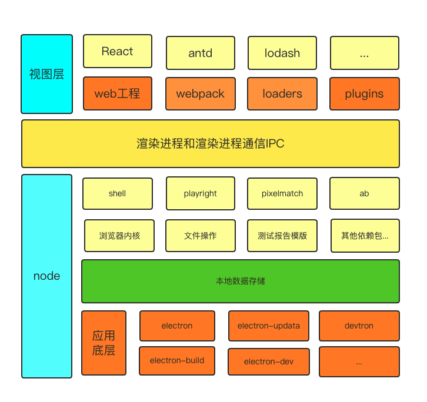

# hello eTest

###### 这是一个集成 ui 还原测试、ete 页面测试、api 接口测试、压力测试的集成测试工具。

-   无需学习编程
-   完善的测试结果
-   自动化运行定时任务以及测试结果推送机制

### 开发的初衷

市面上的测试工具种类很多，很少有一个能同时满足 ui、ete、api、压力测试的测试工具；而且市面上的很多测试工具对测试人员都有一定的编码能力要求，导致自动化测试的学习曲线上升，我们在思考，没有方法实现，不需要测试人员编码，依旧可以实现的测试方式，而且同时可以集成常见的测试类型，自动化生成测试报告，使测试开发者告别繁琐的且重复的测试操作，真正解放测试人员的测试时间，做其他更有意义的工作。

### 现状

1. 开发完成 ui 页面开发后，ui 需要多次介入与开发一起对静态页面的还原度校验，导致开发中沟通成本过高
2. 每次上线后，测试需要对页面进行回归测试，每次上线回归测试都是对页面进行重复的操作，人为操作很容易遗漏到一些测试，出错率比较高
3. 线上的正式运行的项目，无法对接口、以及接口负载的稳定性作出实时评估

### 解决的痛点

1. 集成 UI 还原测试，ete 测试，api 接口测试，压力测试，所有测试任务一个应用完成，后期生成一套完整的测试报告，极大的完善测试对上线项目的分析评估水平
2. 低代码或无代码，极大的提高了测试的开发自动化的效率，而且可移植性较高，极大的提高了测试的测试效率
3. 定时任务，可定制化的消息推送，随时随地都可以对正在运行的项目状态了如指掌。

### 集成测试架构层次图

