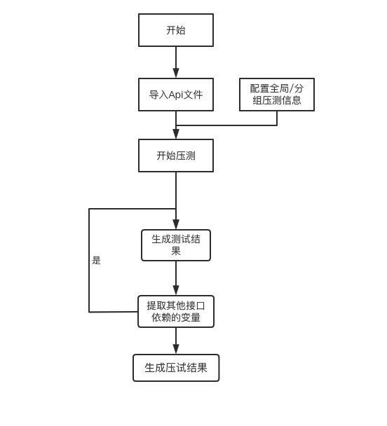

# 压力测试

<!-- ###### 由于日常迭代开发紧张，该功能正在紧急开发中..., 敬请期待 🙏🙏🙏🙏 -->

## 解决痛点

ab 压力测试同 api 测试一样，对测试人员的编码能力有一定的要求，而且如果不在项目上线前做压力测试，就无法精确计算 qps，导致上线后无法确定是否需要加服务器，造成不要的成本浪费，压测可以很好的为计算项目的 qps 提供参考指标，真正做到上线有数。

## 流程图

## 功能列表

1.  支持多并发压测 :heavy_check_mark:
2.  支持生成测试结果 :heavy_check_mark:
3.  支持全局/分组 变量设置 :heavy_check_mark:
4.  支持压测选择 :heavy_check_mark:
5.  支持停止当前任务 :heavy_check_mark:
6.  支持 https 测试 :heavy_check_mark:
7.  支持接口延迟执行 :heavy_check_mark:
8.  支持定时任务 :heavy_check_mark:

## 快速开始

