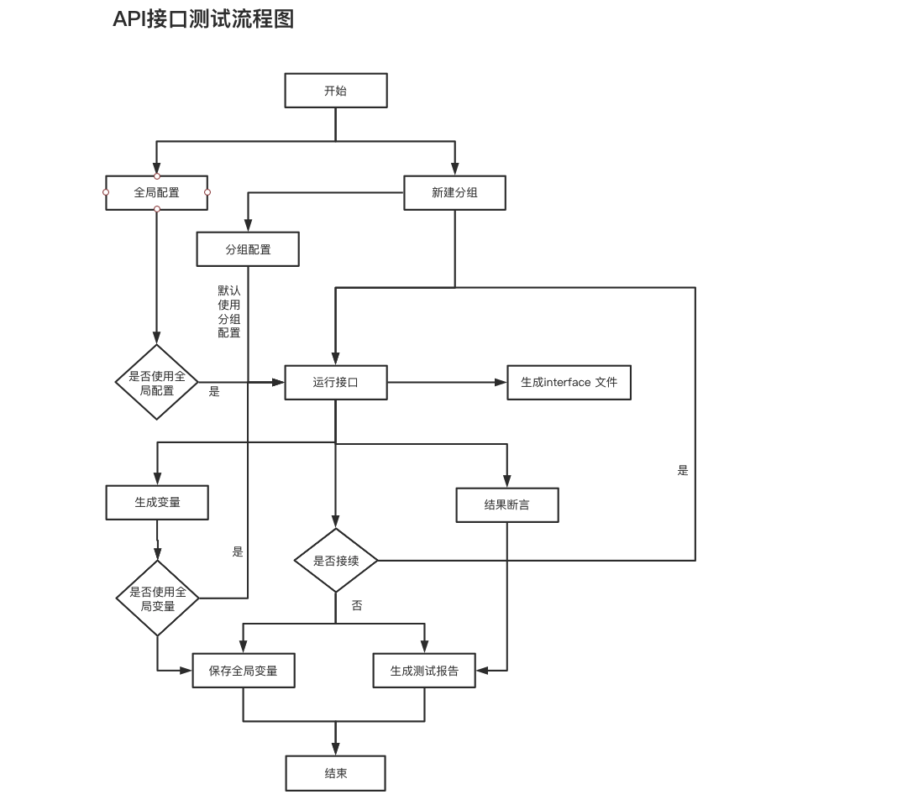

# API

<iframe src="//player.bilibili.com/player.html?aid=249999447&bvid=BV16v411N7En&cid=392077714&page=1" scrolling="no" border="0" frameborder="no" framespacing="0" framespacing="0"  height="600"  style=”width: 100%;height: 500px; max-width: 100%;align:center;padding:20px 0;” > </iframe>

## 解决痛点

## 流程图



## 功能列表

1.  支持接口断言类型检测 :heavy_check_mark:
1.  支持存储变量 :heavy_check_mark:
1.  支持导出 interface :heavy_check_mark:
1.  支持导出测试报告 :heavy_check_mark:
1.  支持自定义返回成功值修改 :heavy_check_mark:
1.  支持自定义函数 :heavy_check_mark:
1.  支持分组选择 :heavy_check_mark:
1.  支持接口、分组拖拽排序 :heavy_check_mark:
1.  支持全局配置请求头，分组配置请求头请求参数 :heavy_check_mark:
1.  支持分组，单个接口复制 :heavy_check_mark:
1.  支持关联性接口测试 :heavy_check_mark:
1.  支持导入导出 API 文件 :heavy_check_mark:
1.  上传下载数据包 :white_check_mark:
1.  修改 content-type 值 :white_check_mark:

## 快速开始

### 新建分组&设置


点击`新增分组` 打开分组弹框，可以单个设置分组配置，分组请求头，分组请求参数，以及自定义分组结果断言
，设置后的分组配置信息，默认是对该分组内的数据生效。分组可拖动排序。复制分组：对分组参数相同，只是个别参数不同可以使用复制分组，提高测试效率

### 添加全局配置


### 添加接口


点击`新建接口` 打开新建弹框，配置单个接口请求方式分为：`GET`、`POST`、`DELETE`、`PUT`、`HEAD`、`OPTIONS`；勾选`使用项目配置`则引用全局配置；url 地址： 如果勾选了`使用项目配置`则是项目配置的 baseUrl 与当前 url 参数拼接；底部的响应体、响应头、Cookie、[断言](#断言)、[**变量**](#变量设置)是接口请求后的信息展示操作； 接口可拖动排序且也可以跨分组拖动排序。

!> `单个编辑`、`批量编辑`是录入参数的两种方式，简单字段参数可以使用单个编辑；复杂数据类型使用批量编辑；建议使用批量编辑

### 断言

接口断言主要是对 api 接口返回的值做期望值断言以及类型断言；


#### 类型断言

1. number：类型检测 number
2. string：类型检测 string
3. boolean：类型检测 boolean
4. undefined：类型检测 undefined
5. null：类型检测 null
6. array：类型检测 array
7. object：类型检测 object

#### 结果值断言

1. greater：结果值大于
2. equal：结果值等于
3. less：结果值小于
4. include：结果值包含
5. exclude：结果值不包含
6. greaterLength：结果值的长度大于
7. equalLength：结果值的长度等于
8. lessLength：结果值的长度小于

### 变量设置

-   [x] 生成变量：勾选后在全局生成一个唯一的 id 作为`key`值 而对应`value`是当前的`value`的`key` 值。
-   [ ] 自定义返回值：自定义返回值是一个高级用法，由于返回的值,不是下一个借口的最终的参数，需要计算才能得到，可以勾选该字段，自定义生成需要的返回值。

!> 由于新加关联接口的时候需要上一次接口返回值作为参数，所以单个执行的时候，会去最近一次的接口返回值;如果取值不是最新的，可以先执行一下，然后再次添加接口操作。

#### 高级设置

自定义函数 主要解决工作流测试和一些变量需要经过计算得到的值，如果是工作流的话，需要在返回需要的关联的接口

```javascript
/**
 * [自定义执行函数]
 * @param    {[any]}               value  [当前选择字段的value值]
 * @param    {[array]}             apilist [api 接口列表]
 * @return   {[Array]}             [] [arr[0]返回处理后的value；arr[1]返回下一个需要执行的Api；arr[2]数组返回一个需要判断执行的接口列表]
 */
function myselfFun(value) {
    let newValue = '';
    let runApi = '';
    let ApiData = ['api001', 'api002'];
    if (value) {
        newValue = value;
        runApi = ApiData[newValue];
    } else {
        newValue = 0;
        runApi = ApiData[newValue];
    }
    return [newValue, runApi, ApiData];
}
```

!> 如果该接口是工作流接口，则勾选后，执行批量测试，该接口不会被直接执行，而是根据自定义函数返回的结果，选择需要执行的接口

### 测试报告


测试报告收集展示当前测试结果信息数据，包含 请求地址、描述、请求方式、请求头、请求参数、响应结果、断言&类型检测；点击 `请求头`、`请求参数`、`响应结果`可以查看接口请求过程中的详细参数信息。

!> 单个接口请求不会生成测试报告

### 导出&导出文件


支持导出 api 测试文件, 导入文件，可以快速构建项目，方便其他测试人员的构建项目
