# API

<iframe src="//player.bilibili.com/player.html?aid=249999447&bvid=BV16v411N7En&cid=392077714&page=1" scrolling="no" border="0" frameborder="no" framespacing="0" framespacing="0"  height="600"  style=”width: 100%;height: 500px; max-width: 100%;align:center;padding:20px 0;” > </iframe>

## 解决痛点

## 流程图

## 支持功能

1. 支持接口断言类型检测
2. 支持存储变量
3. 支持导出 interface
4. 支持导出测试报告
5. 支持自定义返回成功值修改
6. 支持自定义函数
7. 支持分组选择
8. 支持接口、分组拖拽排序
9. 支持全局配置请求头，分组配置请求头请求参数
10. 支持分组，单个接口复制
11. 支持关联性接口测试
12. 支持导入导出 API 文件

## 暂不支持

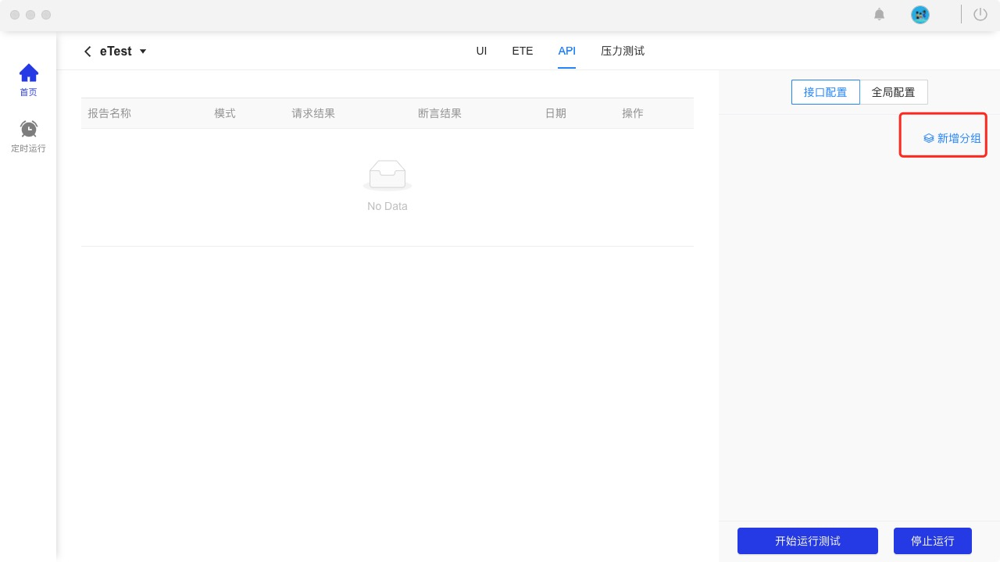
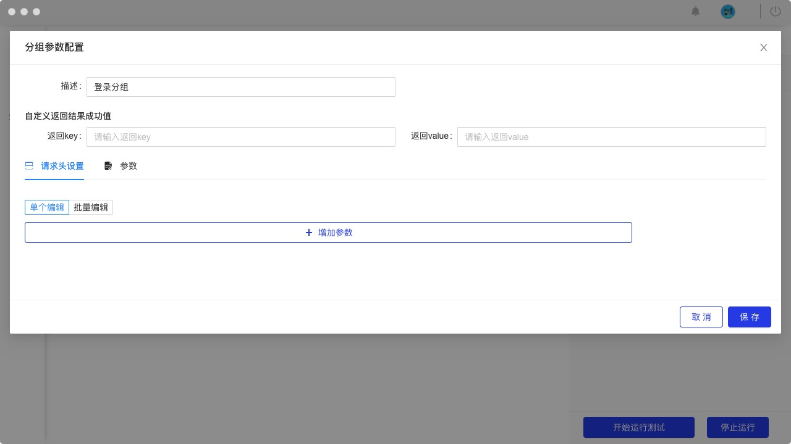
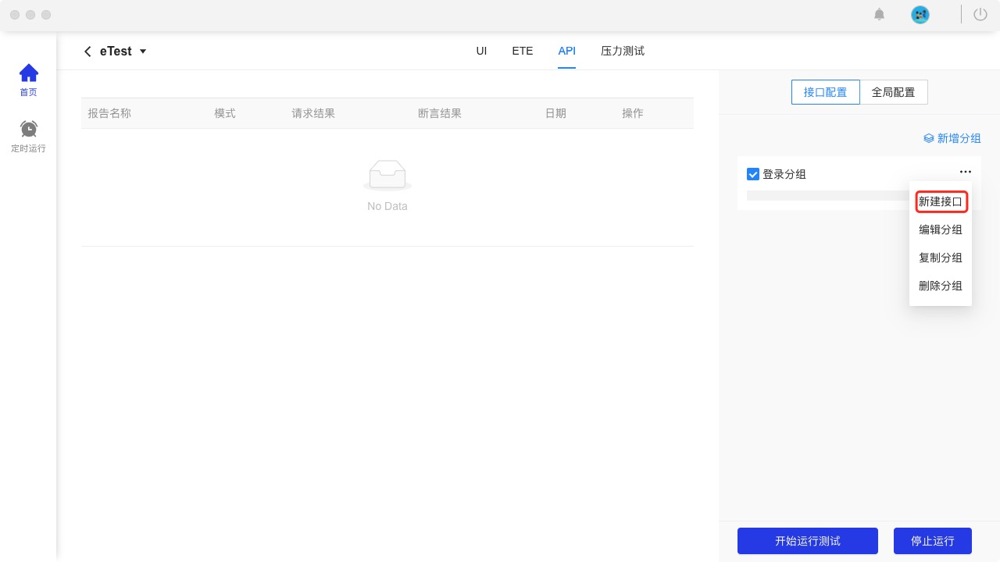
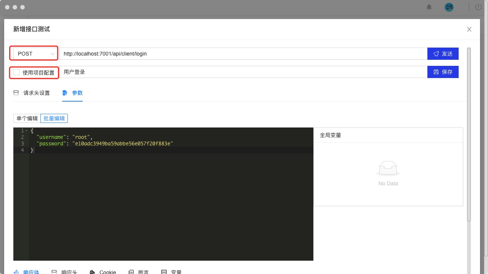
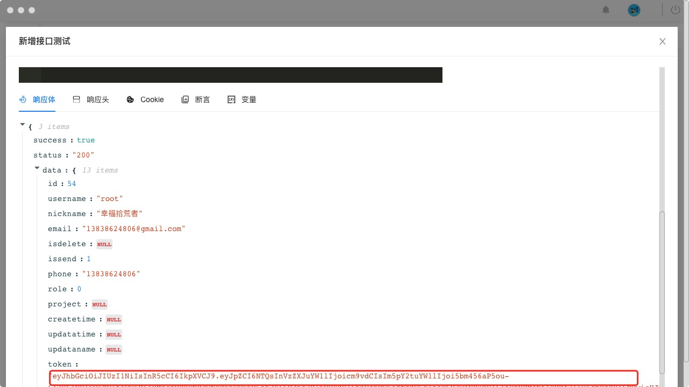
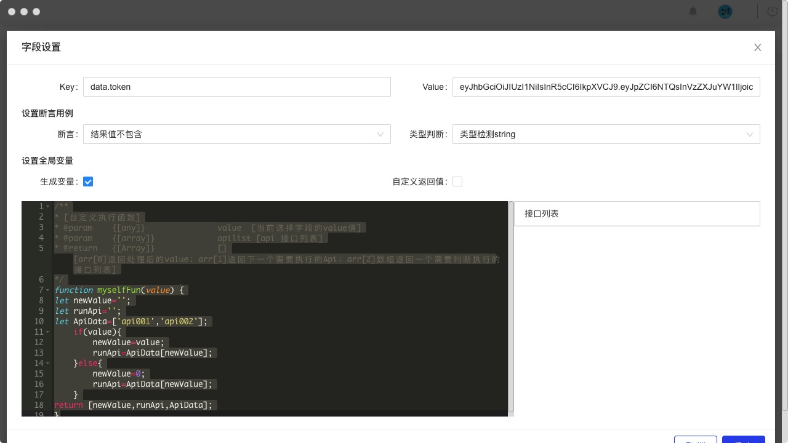
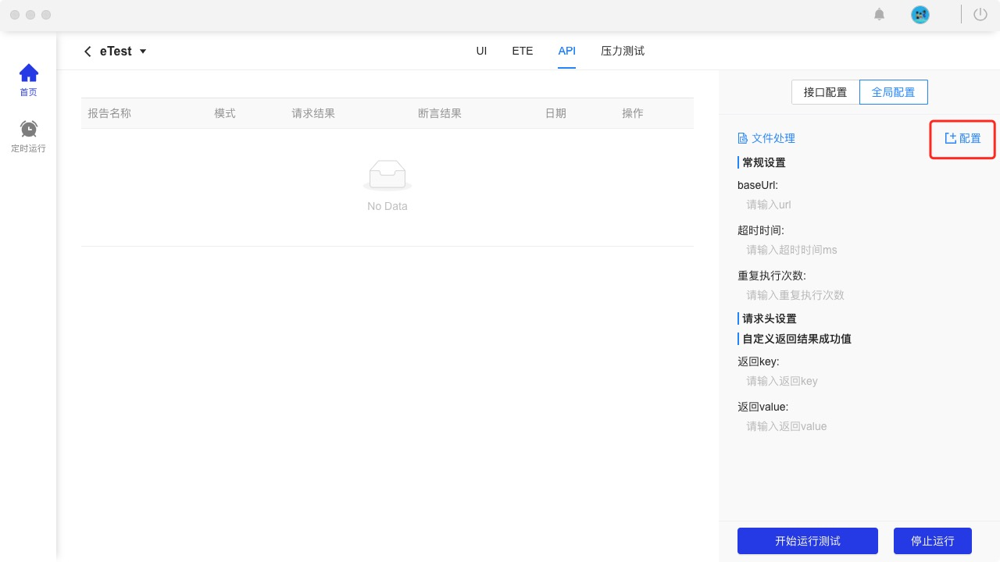
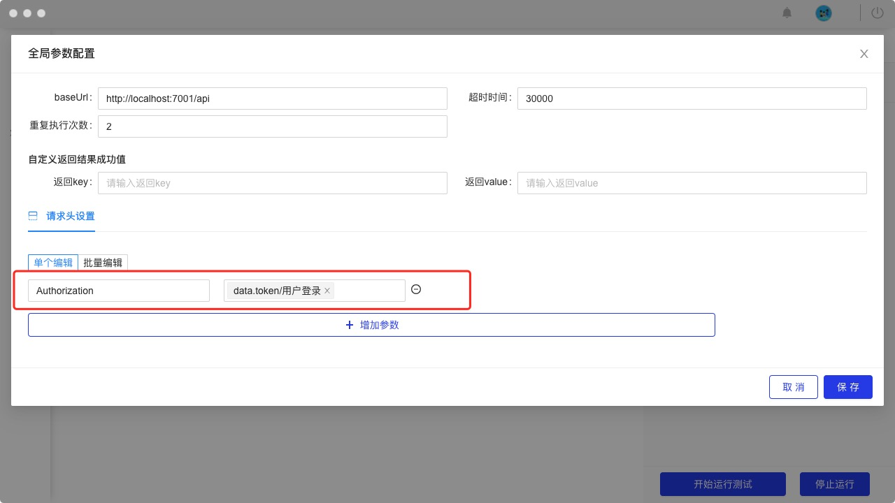
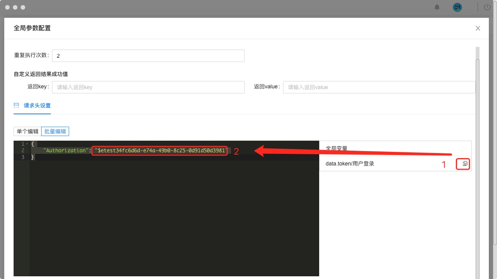

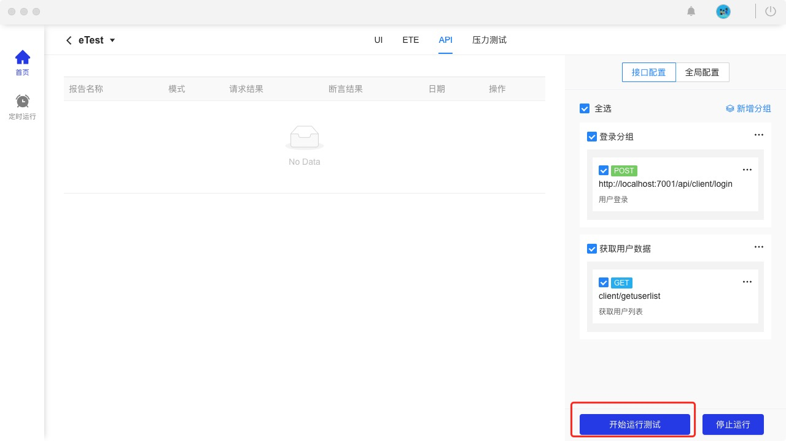
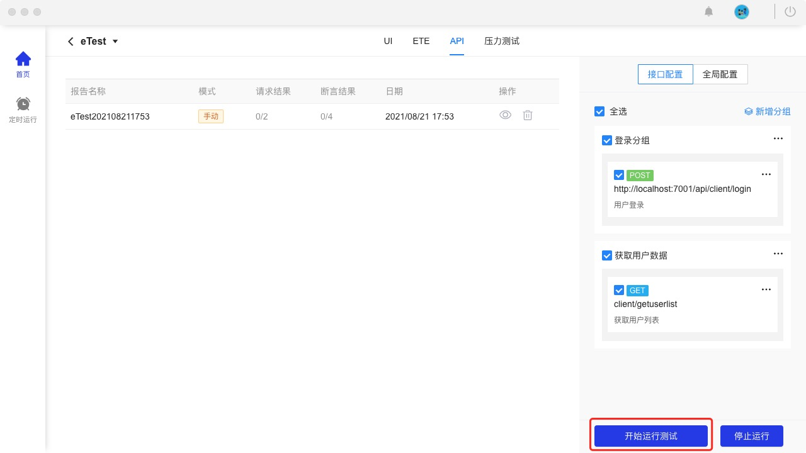
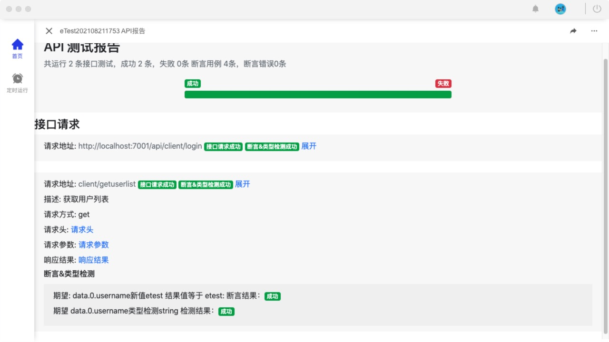
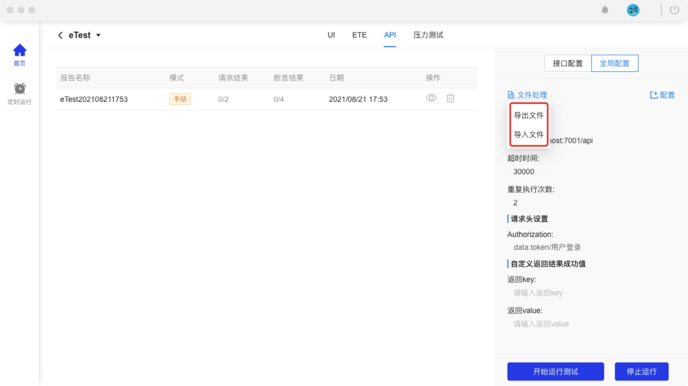

## 快速开始

### 新建分组

### 分组设置

### 添加全局配置

### 添加接口

### 变量设置

### 断言
