# ETE

?> 为页面测试而生， 彻底解决页面测试的繁琐操作，提升测试乐趣！

<iframe src="//player.bilibili.com/player.html?aid=759967057&bvid=BV1764y1v7is&cid=392078147&page=1" scrolling="no" border="0" frameborder="no" framespacing="0" framespacing="0"  height="600"  style=”width: 100%;height: 500px; max-width: 100%;align:center;padding:20px 0;” > </iframe>

### 快速开始

[eTest 插件商店下载](https://chrome.google.com/webstore/detail/etest/nkjmdclbdiljcaeepkclamgboojhdnhi?hl=zh-CN)
[eTest github 下载](https://github.com/onepiece-smile/docs/releases)

## 解决痛点

## 设计流程图

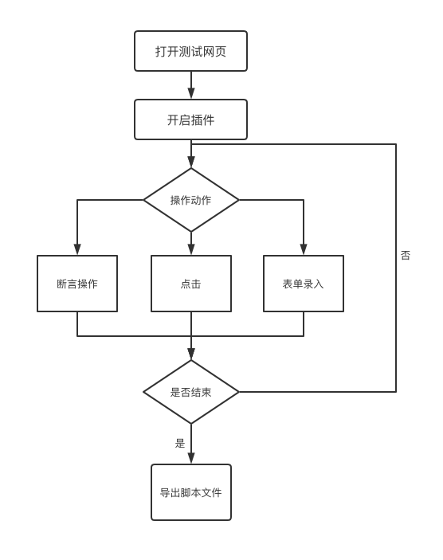

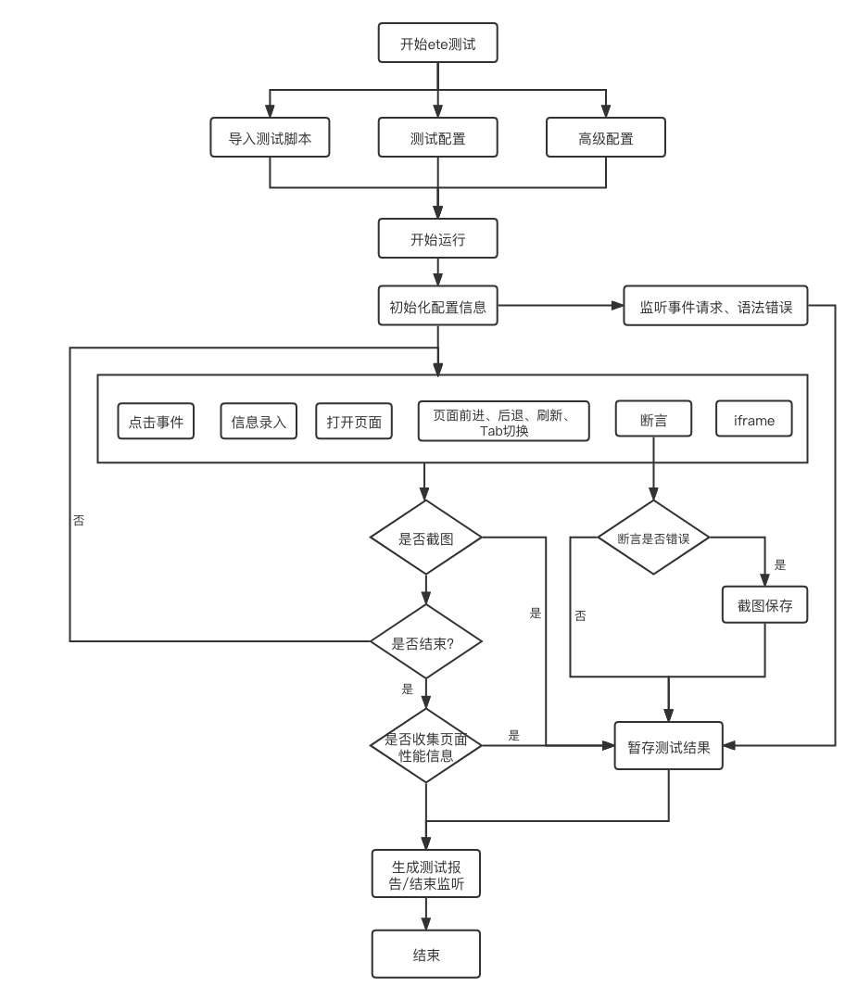

## 支持功能

1. 支持 iframe 多嵌套操作 , 支持动态 iframe 插入问题
2. 支持关闭 alert 提示
3. 支持等待 dom 元素显示
4. 支持页面断言操作，数字类型的大于小于等于操作
5. 支持生成测试报告
6. 支持运行时页面错误收集
7. 支持延时操作处理
8. 支持无头模式
9. 支持录屏回放、
10. 支持等待网络加载完成后操作
11. 解决 xpath 查找 svg 问题
12. 支持阻止默认事件后，依然可以获取事件操作
13. 打包内置浏览器
14. 支持多页录制
15. 支持事件被阻止依旧可以收集
16. 支持错误截图
17. 支持在线修改 json 数据
18. 支持用例拖拽排序

## 快速开始

### 下载 chrome 插件

[eTest 插件商店下载](https://chrome.google.com/webstore/detail/etest/nkjmdclbdiljcaeepkclamgboojhdnhi?hl=zh-CN)
[eTest github 下载](https://github.com/onepiece-smile/docs/releases)

### 录制脚本文件

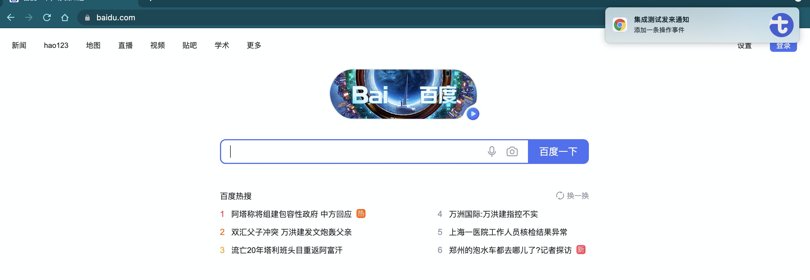
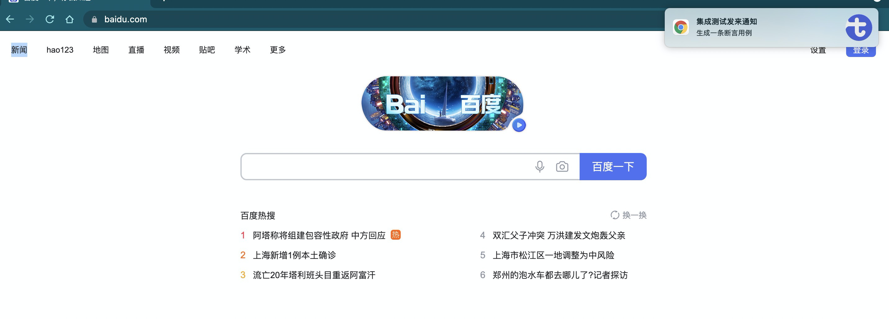
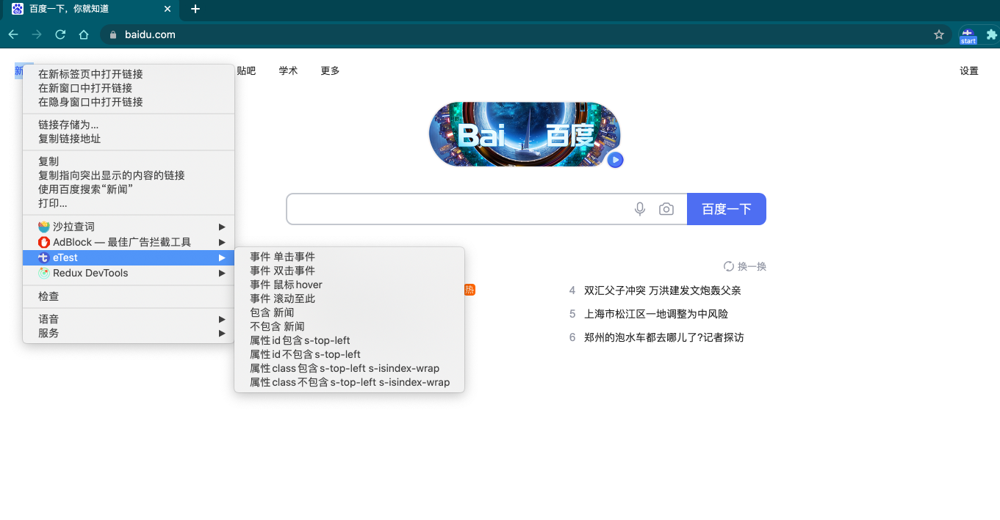

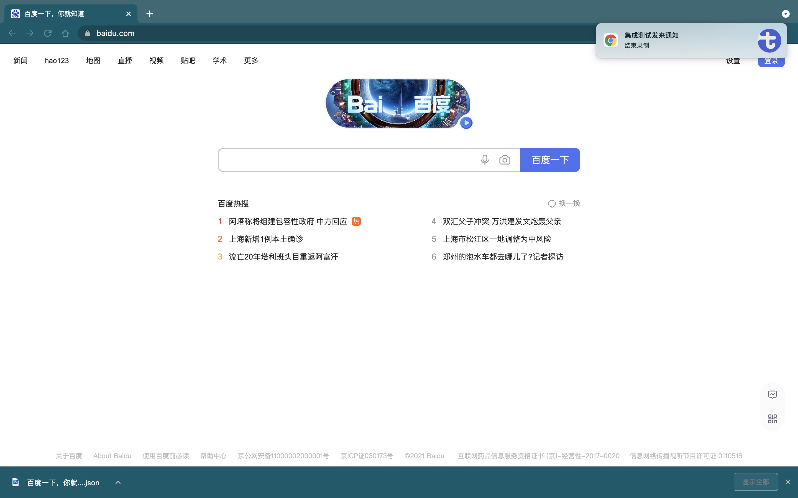

### ete 设置启动

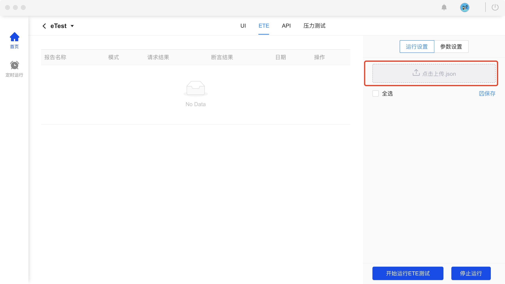
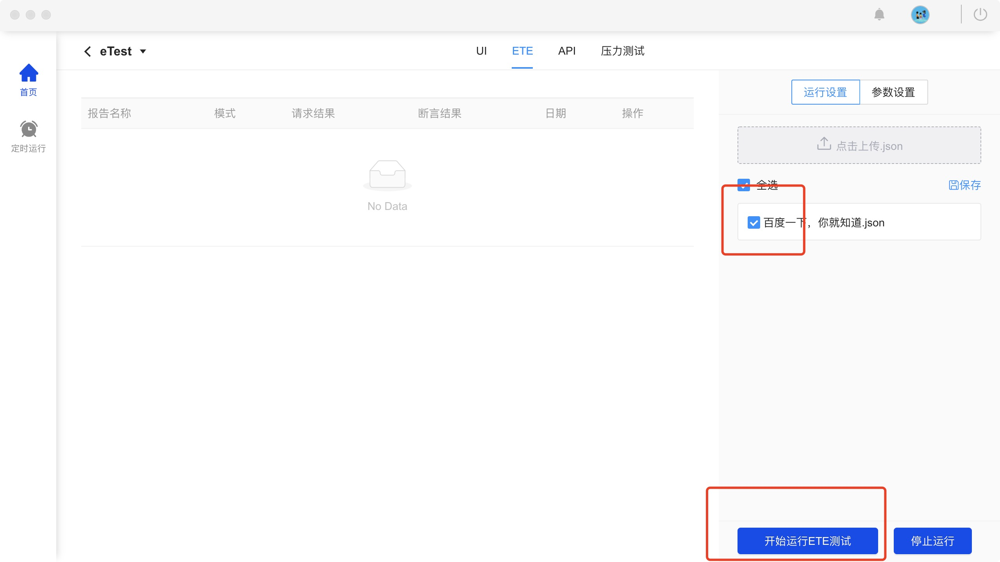
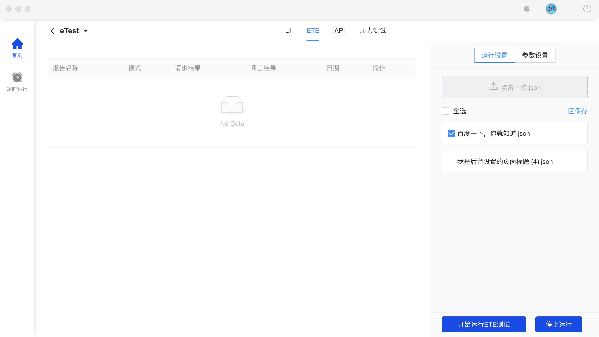
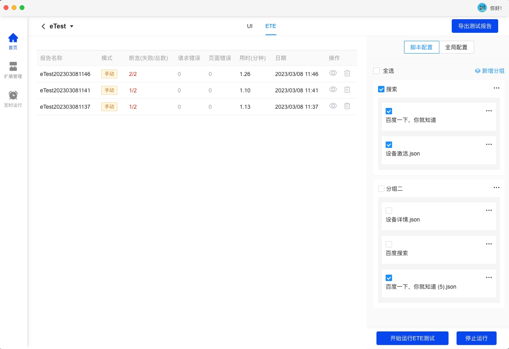
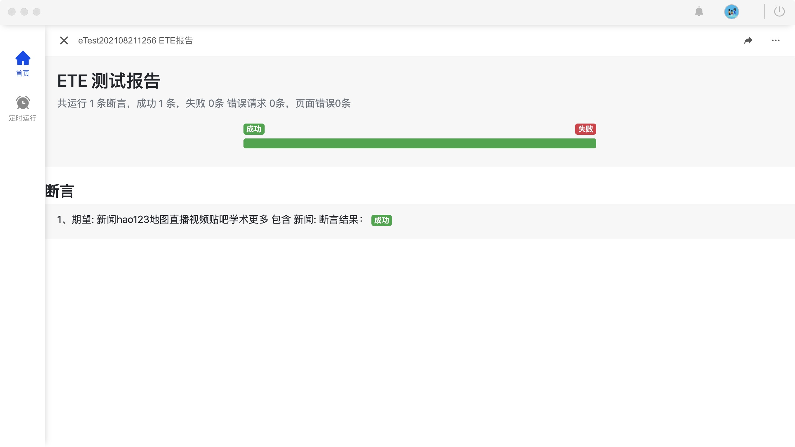

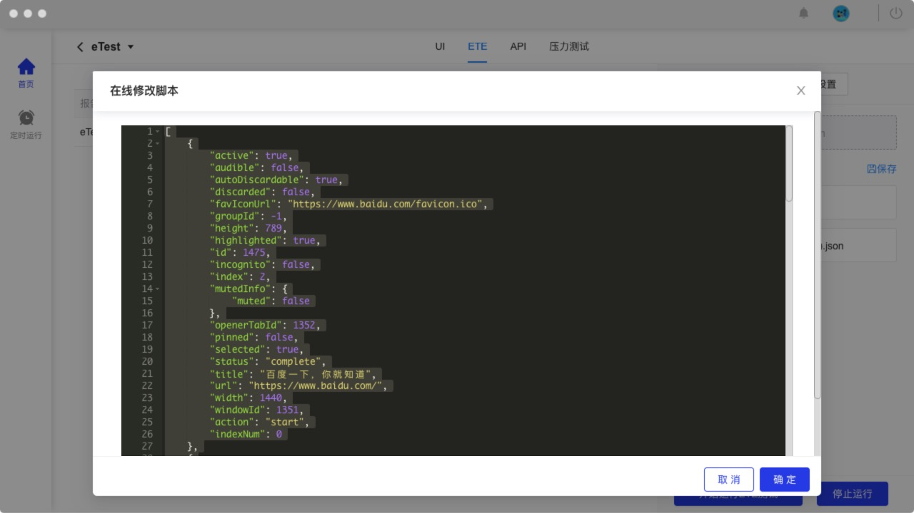
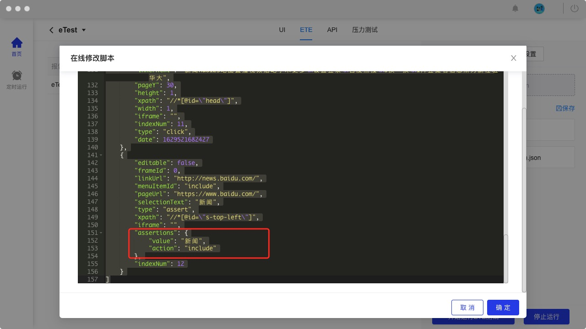

### 添加全局配置

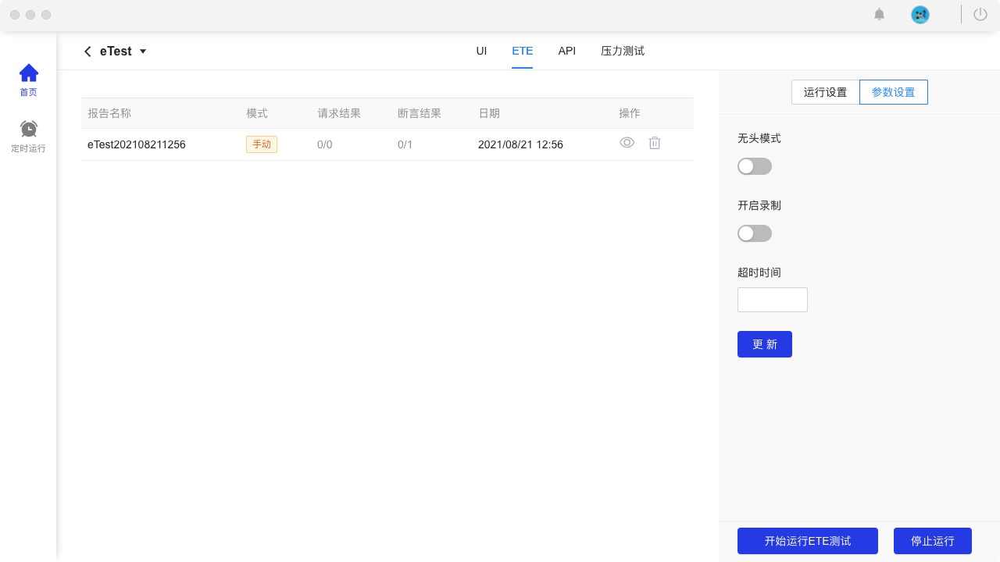
