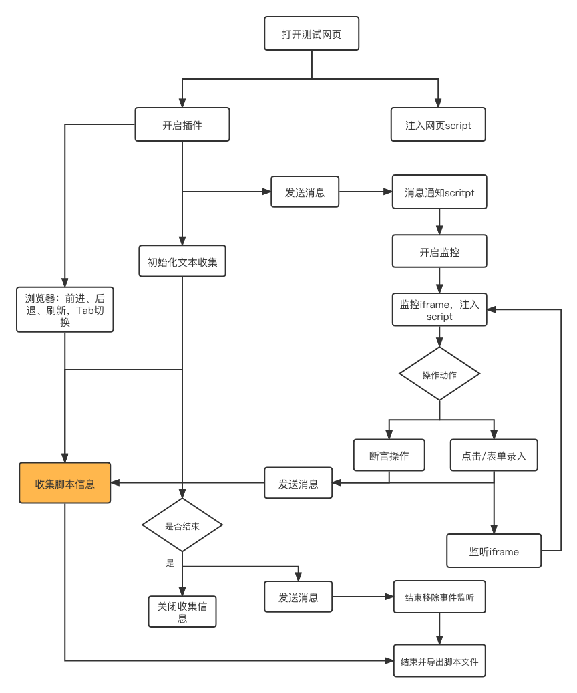

# ETE

?> 为页面测试而生， 彻底解决页面测试的繁琐操作，提升测试乐趣！

<iframe src="//player.bilibili.com/player.html?aid=759967057&bvid=BV1764y1v7is&cid=392078147&page=1" scrolling="no" border="0" frameborder="no" framespacing="0" framespacing="0"  height="600"  style=”width: 100%;height: 500px; max-width: 100%;align:center;padding:20px 0;” > </iframe>

## 解决痛点

## 流程设计图

#### 浏览器录制脚本流程图

ete 测试，需要依赖操作者操作，收集录制脚本信息，所以需要安装 chrome 插件，通过启用插件，收集用户操作信息，生成 ete 测试需要的脚本文件。

!> Chrome 插件下载方式 [eTest 插件商店下载](https://chrome.google.com/webstore/detail/etest/nkjmdclbdiljcaeepkclamgboojhdnhi?hl=zh-CN) 或者 [eTest github 下载](https://github.com/onepiece-smile/docs/releases)

#### ETE 执行脚本流程图

## 支持功能

1. 支持 iframe 多嵌套操作 , 支持动态 iframe 插入问题 :heavy_check_mark:
2. 支持关闭 alert 提示 :heavy_check_mark:
3. 支持等待 dom 元素显示 :heavy_check_mark:
4. 支持页面断言操作，数字类型的大于小于等于操作 :heavy_check_mark:
5. 支持生成测试报告 :heavy_check_mark:
6. 支持运行时页面错误收集 :heavy_check_mark:
7. 支持延时操作处理 :heavy_check_mark:
8. 支持无头模式 :heavy_check_mark:
9. 支持录屏回放、 :heavy_check_mark:
10. 支持等待网络加载完成后操作 :heavy_check_mark:
11. 解决 xpath 查找 svg 问题 :heavy_check_mark:
12. 支持阻止默认事件后，依然可以获取事件操作 :heavy_check_mark:
13. 打包内置浏览器 :heavy_check_mark:
14. 支持多页录制 :heavy_check_mark:
15. 支持事件被阻止依旧可以收集 :heavy_check_mark:
16. 支持错误截图 :heavy_check_mark:
17. 支持在线修改 json 数据 :heavy_check_mark:
18. 支持用例拖拽排序 :heavy_check_mark:

## 快速开始

### 下载 chrome 插件

!> Chrome 插件下载方式 [eTest 插件商店下载](https://chrome.google.com/webstore/detail/etest/nkjmdclbdiljcaeepkclamgboojhdnhi?hl=zh-CN) 或者 [eTest github 下载](https://github.com/onepiece-smile/docs/releases)

### 录制脚本文件

打开右上角的 chrome 插件 点击小图标出现 `start` 状态，表示已启动测试脚本录制

点击网页操作，eTest插件提示 `添加一条操作事件` ，说明eTest插件正在记录用户在页面的操作。

!> 点击时间， 文本框，下拉框改变 都会触发该动作

选中文本，鼠标右键，选择期望的断言结果

#### 断言值

根据用户选中的文本自动判断 `string`或者 `number`类型，然后自动生成需要的测试用例菜单列表，

?> 1. 选择文本时，会自动选择当前标签内的全部内容。 2. 如果选中的文本是含有两个相邻标签的内容，则会默认选中第一个标签的全部内容。

##### 事件

1. click:单击事件
1. dbclick:双击事件
1. hover:鼠标 hover
1. scroll:滚动至此

##### 文本断言

1. include:包含当前值
1. exclude:不包含当前值

##### 数字断言

1. greater：大于当前值
1. equal：等于 当前值
1. less：小于当前值

##### 属性值断言(class、id、data、 type....)

1. include:包含当前值
1. exclude:不包含当前值

点击右上 eTest 图标，结束测试脚本录制，并且生成测试脚本文件，下载到本地

?> 如果测试脚本用例小于 2 条，则不会

### ete 设置启动

### 添加全局配置

