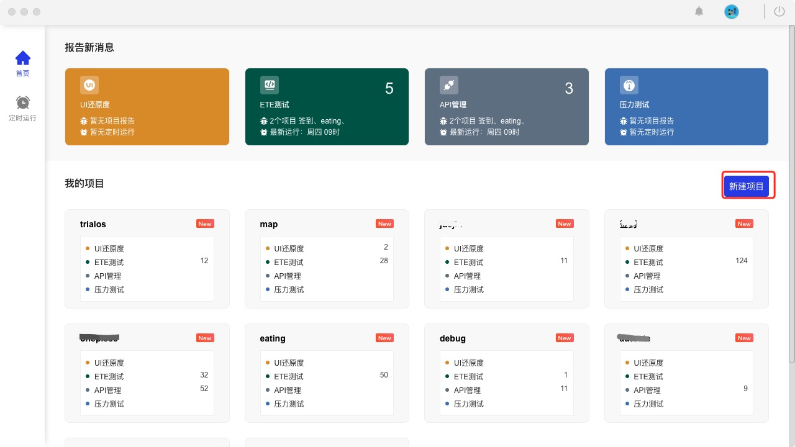
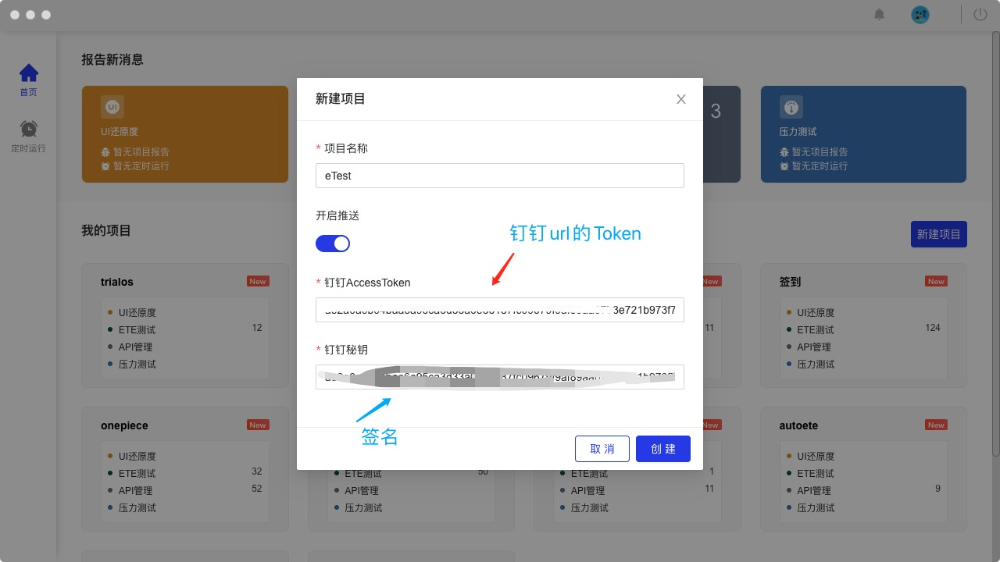
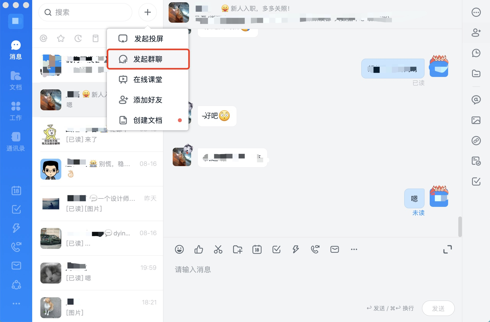
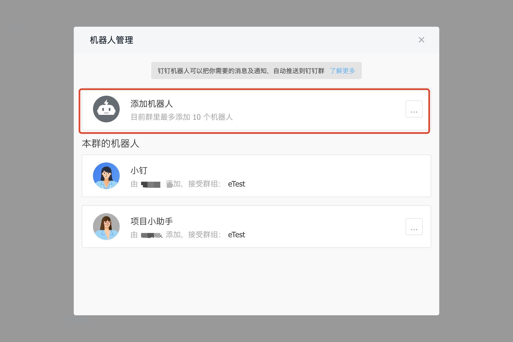
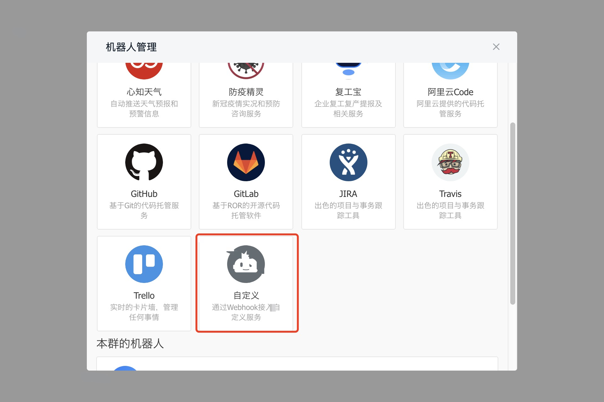
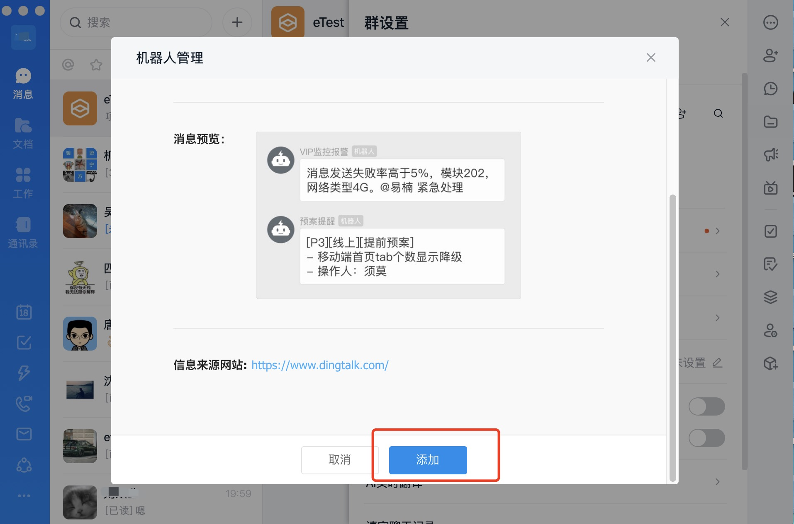
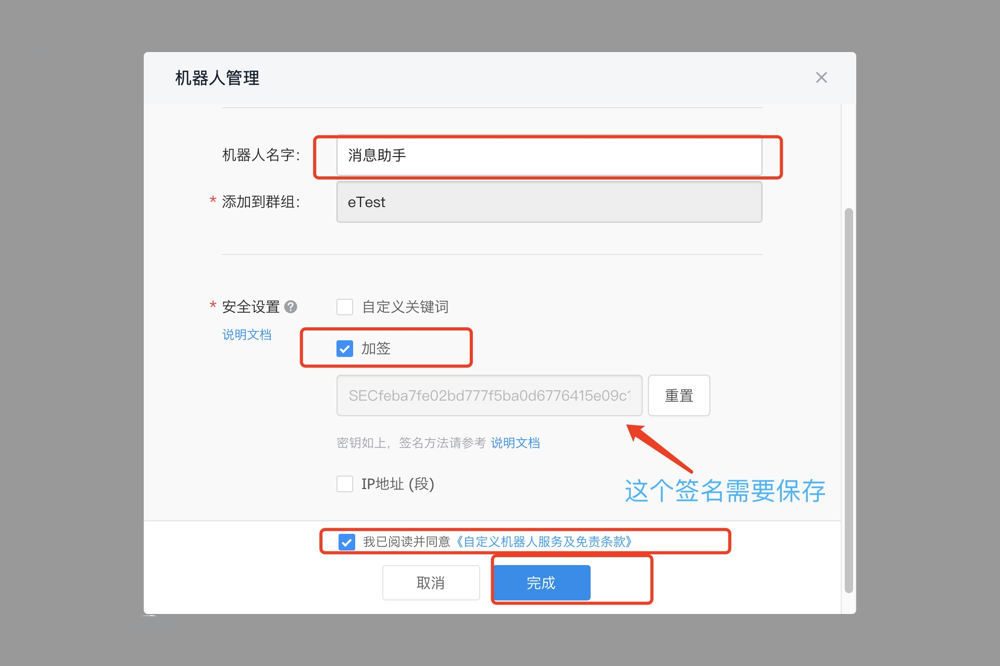
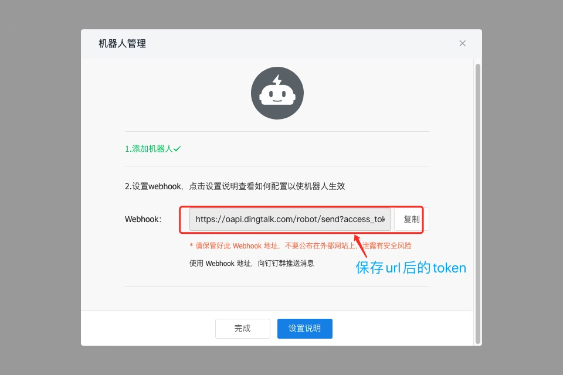
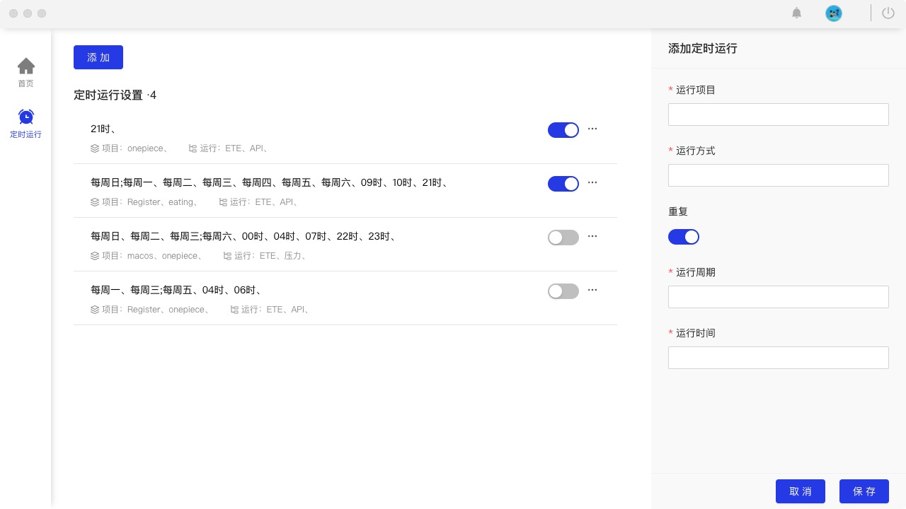
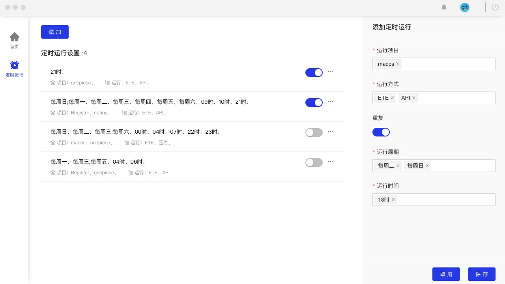

# 快速开始

## 新建项目

## 设置钉钉推送

## 定时任务配置

## 支持功能

1. 支持获取当前网络状态
2. 监控 eTest 后台系统报错收集
3. 支持请求错误数据收集汇总
4. 支持定时测试任务
5. 设置定时任务错误阀值 80%

## 暂不支持

1. 页面元素拖拽
2. 下拉框多选问题
3. redio 操作有点问题 需要点击到 click
4. 快捷键输入
5. 多 tab 页面交互操作

<!--
debug eTest 缺点。难点。  计划迭代
mysql，
发送请求方式，
充分利用 浏览器空闲时间ifvisible.js
过滤错误信息
indexdb
页面还有些问题bug
心跳包检测

难点： 接入录屏  错误上传

计划迭代

eTest

-->
