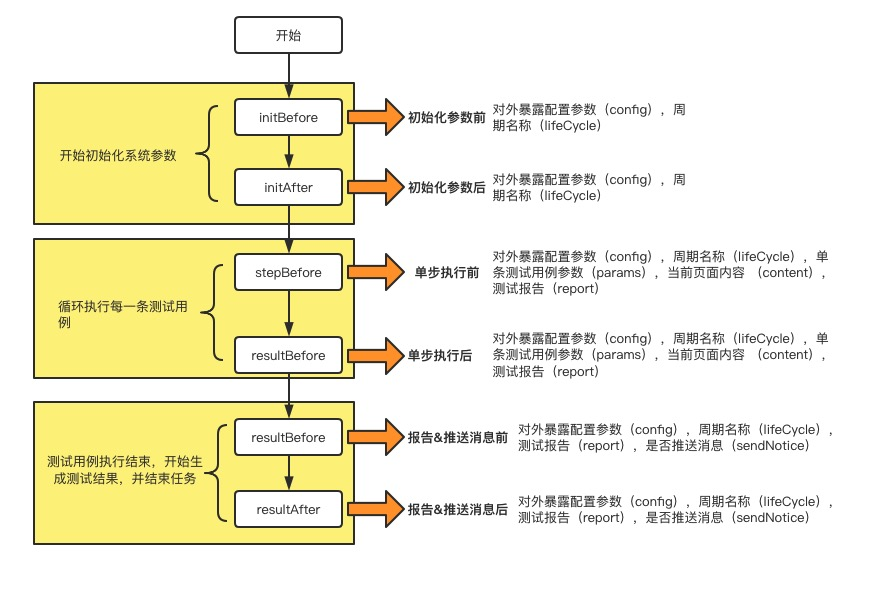
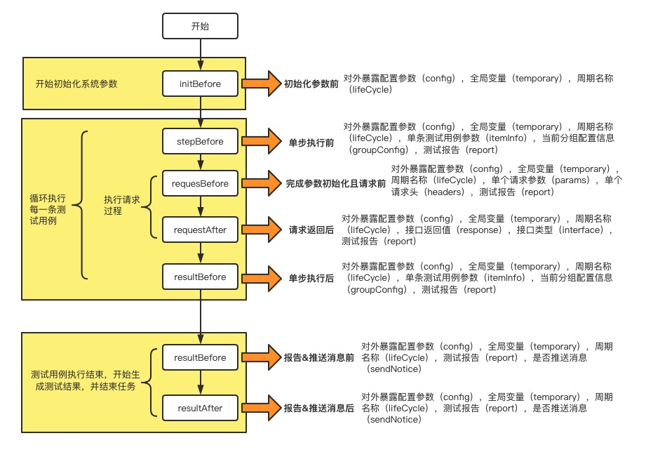

# 扩展管理

为了增强 ETE、API、UI 测试功能，满足更多的测试场景，我们引入了扩展功能，为方便测试自身特定的场景，可以自定义一些测试函数、插件来满足需求；通过可插拔的使用方式，强大的扩展能力，全方位覆盖测试场景。

## 函数管理

我们在系统内置了一些常见的函数，这些函数是不能修改的，如果还是满足不了用户需求，我们开放了自定义函数功能，开发者只需要按照要求编写自己需要的函数即可

```javascript
/**
 * [myselfFun 自定义取值函数]
 * @version                           1.0
 * @param    {[object]}                 config [需要修改变量的参数]
 * @return   {[string||number]}     [必须有返回值返回值会作为当前执行参数信息]
 */
function myselfFun(config) {
    //todo something
    return item;
}
```

## 自定义插件

插件功能我们为了开发者可以对每一步测试都可以做操作，特地引入了`webpack`使用的`tapable`来管理每一步测试，向外暴露了大量的生命周期，开发者可以根据自身需要自定义自己的插件，以满足测试场景，增强测试功能。

### ETE

#### ETE 插件执行流程图



#### 生命周期钩子

1. 初始化参数前(initBefore)：自定义是否需要执行、 自定义 api、 修改配置参数(设置 无头模式，性能分析，行为快照，开启调试，高就配置，插件，超时时间)。
2. 初始化参数后(initAfter)：自定义是否需要执行、 自定义 api、修改配置参数(设置 无头模式，性能分析，行为快照，开启调试，高就配置，插件，超时时间)。
3. 单步执行前(stepBefore)：单个定义过滤执行用例（满足条件）、单个修改参数（在文件中查找）、链接数据库断言、单个自定义断言、自定义 api。
4. 单步执行后(stepAfter)：单个修改断言、单个替换断言、链接数据库断言、自定义 api。
5. 报告&推送消息前(resultBefore)：批量修改测试报告、批量修改推送信息、定义推送规则、自定义推送 api
6. 报告&推送消息后(resultAfter)：自定义 api

### example

```javascript
function myselfPlugin(config, callBack) {
    const itemInfor = {
        config: config.config,
        params: config.item,
        sendNotice: false,
        report: '',
        isEllipsis: false,
        isReplace: false
    };
    callBack(null, itemInfor);
}
```

#### 参数

##### config

| 参数       | 说明                               | 类型    | 默认值 | 有效使用周期                                     |
| ---------- | ---------------------------------- | ------- | ------ | ------------------------------------------------ |
| config     | 项目配置信息和项目信息             | object  | -      | ALL                                              |
| params     | 单个执行参数信息                   | object  | -      | stepBefore、stepAfter                            |
| content    | 每一次执行用例测试的 html 页面内容 | string  | -      | stepBefore、stepAfter                            |
| report     | 测试报告结果                       | Array   | -      | stepBefore、stepAfter、resultBefore、resultAfter |
| lifeCycle  | 周期名称                           | string  | -      | ALL                                              |
| sendNotice | 是否在执行完毕后发生消息           | boolean | -      | resultBefore、resultAfter                        |

#### callBack(param1,param2) `tapable`暴露的周期函数

##### param1

| 参数   | 说明                                             | 类型        | 默认值 | 有效使用周期 |
| ------ | ------------------------------------------------ | ----------- | ------ | ------------ |
| param1 | 如果参数不为 null,则返回执行错误并且停止执行测试 | null string | -      | ALL          |

##### param2(插件修改返回值)

| 参数       | 说明                     | 类型    | 默认值 | 有效使用周期                        |
| ---------- | ------------------------ | ------- | ------ | ----------------------------------- |
| config     | 项目配置信息和项目信息   | object  | -      | initBefore、initAfter               |
| params     | 单个执行参数             | object  | -      | stepBefore、stepAfter               |
| report     | 测试报告结果             | Array   | -      | stepBefore、stepAfter、resultBefore |
| sendNotice | 是否在执行完毕后发生消息 | boolean | -      | resultBefore                        |
| isEllipsis | 是否省略执行本次测试用例 | boolean | false  | stepBefore                          |
| isReplace  | 是否是替换测试报告       | boolean | false  | stepBefore、stepAfter               |

### API

#### API 插件执行流程图



#### 生命周期钩子

1. 初始化参数前(initBefore)：自定义是否需要执行、 自定义 api、 修改配置参数(设置 无头模式，性能分析，行为快照，开启调试，高就配置，插件，超时时间)。
2. 单步执行前(stepBefore)：单个定义过滤执行用例（满足条件）、单个修改参数（在文件中查找）、链接数据库断言、单个自定义断言、自定义 api。
3. 完成参数初始化且请求前(requesBefore):修改请求头，请求体，或终止操作
4. 请求返回后(requestAfter):修改返回值
5. 单步执行后(stepAfter)：单个修改断言、单个替换断言、链接数据库断言、自定义 api。
6. 生成报告&发送消息前(resultBefore)：批量修改测试报告、批量修改推送信息、定义推送规则、自定义推送 api
7. 生成报告&发送消息后(resultAfter)：自定义 api

##### config

| 参数        | 说明                       | 类型    | 默认值 | 有效使用周期                                                                 |
| ----------- | -------------------------- | ------- | ------ | ---------------------------------------------------------------------------- |
| config      | 项目配置信息和项目信息     | object  | -      | ALL                                                                          |
| itemInfo    | 当前单个执行参数信息       | object  | -      | stepBefore、stepAfter                                                        |
| groupConfig | 分组配置                   | object  | -      | stepBefore、stepAfter                                                        |
| headers     | 单个请求头 信息            | object  | -      | requesBefore                                                                 |
| params      | 单个请求参数信息           | object  | -      | requesBefore                                                                 |
| temporary   | 全局变量信息参数，动态添加 | object  | -      | ALL                                                                          |
| response    | 接口返回值                 | object  | -      | requestAfter                                                                 |
| interface   | 接口类型                   | Array   | -      | requestAfter                                                                 |
| report      | 测试报告结果               | Array   | -      | stepBefore、requesBefore、requestAfter、stepAfter、resultBefore、resultAfter |
| lifeCycle   | 周期名称                   | string  | -      | ALL                                                                          |
| sendNotice  | 是否在执行完毕后发生消息   | boolean | -      | resultBefore、resultAfter                                                    |

#### callBack(param1,param2) `tapable`暴露的周期函数

##### param1

| 参数   | 说明                                             | 类型        | 默认值 | 有效使用周期 |
| ------ | ------------------------------------------------ | ----------- | ------ | ------------ |
| param1 | 如果参数不为 null,则返回执行错误并且停止执行测试 | null string | -      | ALL          |

##### param2(插件修改返回值)

| 参数        | 说明                       | 类型    | 默认值 | 有效使用周期                                        |
| ----------- | -------------------------- | ------- | ------ | --------------------------------------------------- |
| config      | 项目配置信息和项目信息     | object  | -      | initBefore                                          |
| temporary   | 全局变量信息参数，动态添加 | object  | -      | stepBefore、requesBefore 、requestAfter , stepAfter |
| headers     | 单个请求头 信息            | object  | -      | requesBefore                                        |
| params      | 单个执行参数               | object  | -      | requesBefore                                        |
| itemInfo    | 当前单个执行参数信息       | object  | -      | stepBefore                                          |
| groupConfig | 分组配置                   | object  | -      | stepBefore                                          |
| response    | 接口返回值                 | object  | -      | requestAfter                                        |
| report      | 测试报告结果               | Array   | -      | stepBefore、stepAfter、resultBefore                 |
| sendNotice  | 是否在执行完毕后发生消息   | boolean | -      | resultBefore                                        |
| isEllipsis  | 是否省略执行本次测试用例   | boolean | false  | stepBefore                                          |
| isReplace   | 是否是替换测试报告         | boolean | false  | stepBefore、stepAfter                               |

### 压力

<!--
开始前：修改配置参数、自定义是否需要执行
开始后：修改配置参数、自定义是否需要执行
单步前：定义过滤执行用例（满足条件）、修改参数（在文件中查找）、数据库断言、自定义断言；
单步后：修改断言，替换断言
报告前：修改测试报告，修改推送信息，自定义推送规则，自定义推送 api
包告后：修改推送信息，自定义推送规则，自定义推送 api
-->
