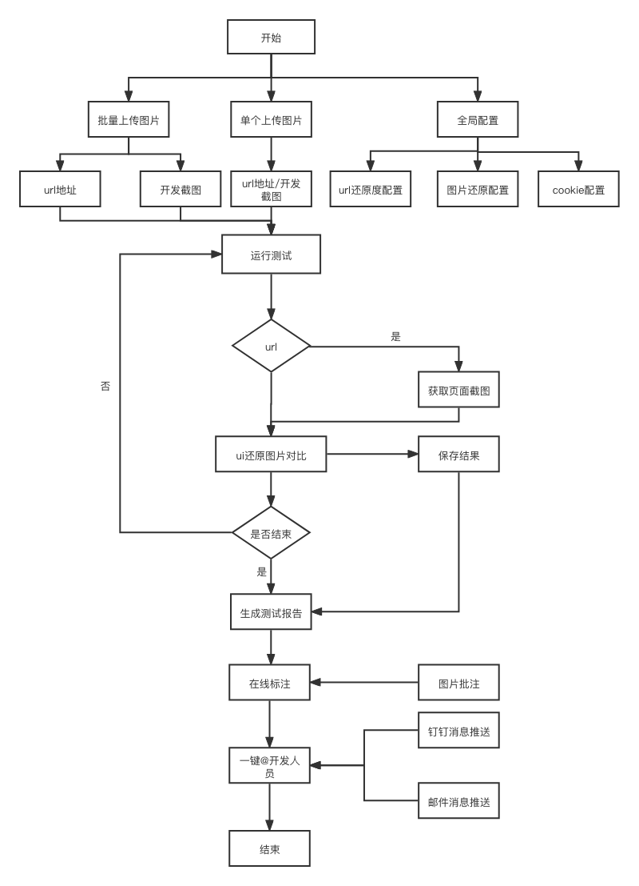

# UI

<iframe src="//player.bilibili.com/player.html?aid=865632005&bvid=BV1654y1T7uF&cid=1044463115&page=1" scrolling="no" border="0" frameborder="no" framespacing="0"  height="600"  style=”width: 100%;height: 500px; max-width: 100%;align:center;padding:20px 0;”> </iframe>

## 解决痛点

对于 ui 设计稿的还原度，是 C 端开发人员的一个工作重点，设计稿还原的好坏对一个项目要求至关重要。而且在页面还原度的问题上，我们经常看到开发经常找 UI 设计师沟通，这就大大提高了沟通成本，导致后续的开发时间压缩；集成测试的 UI 还原功能可以减少开发与 UI 设计师的沟通成本，只需设计把 UI 设计稿与开发的页面按要求，导入集成测试中，然后就会生成测试报告，开发只要根据测试结果修改，就可以修改，节约沟通成本，大大提高了开发人员的效率。

## UI 还原测试流程图

## 功能列表

1.  支持 UI 设计图和网页 url 比较 :heavy_check_mark:
2.  支持 UI 设计图和截图比较 :heavy_check_mark:
3.  支持运行还原测试时，排除掉某些项目 :heavy_check_mark:
4.  支持批量新增 :heavy_check_mark:
5.  支持设备类型设置，区分 PC 和 Mobile :heavy_check_mark:
6.  支持自定义对比颜色 :heavy_check_mark:
7.  支持生成测试报告 :heavy_check_mark:
8.  支持自定义配置颜色 :heavy_check_mark:
9.  支持自定义截图设置 cookie :heavy_check_mark:
10. 支持在线对生成的对比图片做备注 :heavy_check_mark:
11. 支持在线批量下载对比图片 :heavy_check_mark:

## 快速开始

### 设置全局对比参数

-   选择设备类型，设置 dpr
-   设置差异对比时的颜色标注等

如果有页面传参需求，可点击`参数配置`进行设置

### 新增配置

切换至 UI 配置，点击新增，可选单个新增和批量新增

#### 单个新增

-   新增 url 与 ui 图比对，上传 ui 设计图，输入网址

-   新增截图与 ui 图比对，点击右下角`使用图片对比`，上传 ui 设计图，上传开发完成的截图

#### 批量新增

-   将需要对比的图片批量上传
-   自行拖动到对应的区域，其中等待或者废弃区会在保存时丢弃

### 运行测试

对比设置完毕，点击`开始运行UI还原测试`，即可生成对应的测试报告

### 报告列表

测试报告列表，操作栏从左到右分别是 查看报告详情 | 图片备注 | 下载 | 删除

点击`查看报告详情`，即可看到还原度信息，原型图、网页截图、差异对比图的展示

点击`图片备注`， 即可对每张图片进行备注，方便开发人员和测试人员直接在图片上沟通

点击`下载`， 即可将所有图片下载打包

点击`删除`， 即可删除当前生成的报告
