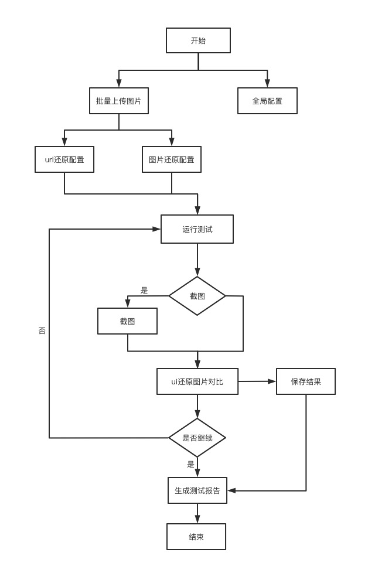

# UI

<iframe src="//player.bilibili.com/player.html?aid=207491379&bvid=BV1dh411i77h&cid=392185194&page=1"  scrolling="no" border="0" frameborder="no" framespacing="0"  height="600"  style=”width: 100%;height: 500px; max-width: 100%;align:center;padding:20px 0;”> </iframe>

## 解决痛点

对于 ui 设计稿的还原度，是 C 端开发人员的一个重点重做，设计稿还原的好坏对一个项目要求至关重要。而且在页面还原度的问题上，我们经常看到开发经常找 UI 设计师沟通，这就大大提高了沟通成本，导致后续的开发时间压缩；集成测试的 UI 还原功能可以减少开发与 UI 设计师的沟通成本，只需设计把 UI 设计稿与开发的页面按要求，导入集成测试中，然后就会生成测试报告，开发只要根据测试结果修改，就可以修改，节约沟通成本，大大提高了开发人员的效率。

## UI 还原测试流程图

## 功能列表
01. 支持UI设计图和网页url比较 :heavy_check_mark:
02. 支持UI设计图和截图比较 :heavy_check_mark:
03. 支持运行还原测试时，排除掉某些项目 :heavy_check_mark:
04. 支持批量新增 :heavy_check_mark:
05. 支持设备类型设置，区分PC和Mobile :heavy_check_mark:
06. 支持自定义对比颜色 :heavy_check_mark:
07. 支持生成测试报告 :heavy_check_mark:
08. 支持在生成的对比图片上备注 :white_check_mark:

## 快速开始
