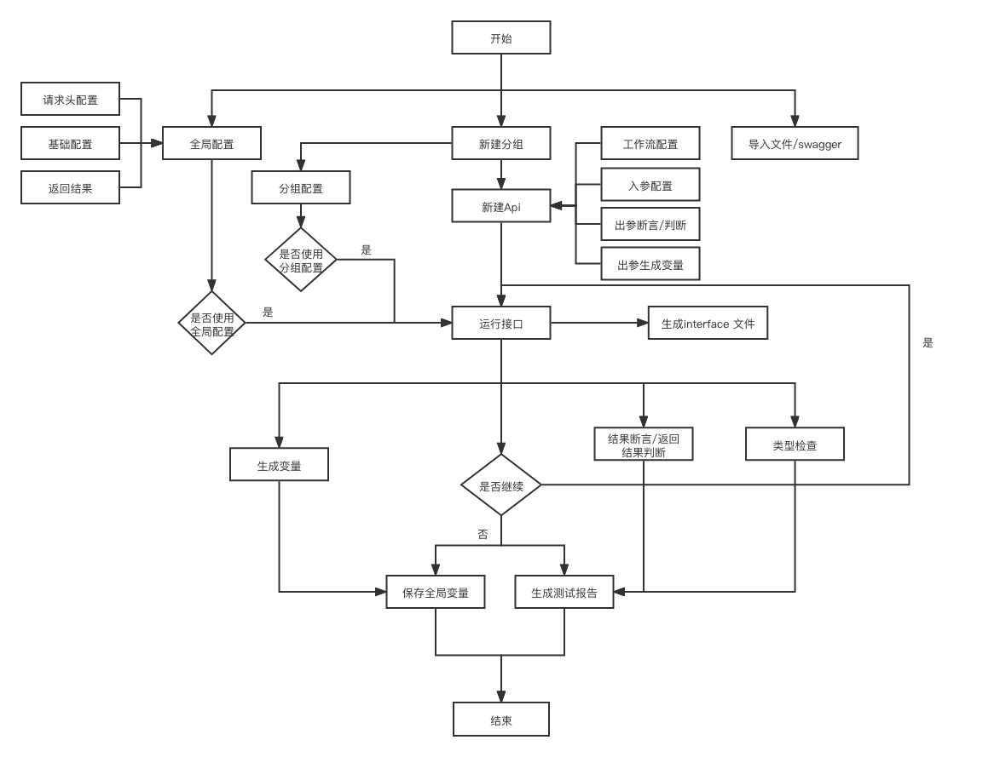

# eTest 浅谈 api 接口测试

说到接口测试工具，市面的 GUI 测试框架也有很多，比如 postman ,Jmeter 等，而且 postman ,Jmeter 在做接口测试功能很强大，稳定性也很强，而且也可以与 cicd 集成，为什么 eTest 测试工具 还需要集成接口测试功能呢？主要是这两款接口测试工具对于关联性测试不是很友好，需要 coding 才能实现，而且上手比较复杂，我们的目标就是`0代码`，一切需要 coding 的都需要简化。那[eTest 测试工具](https://onepiece-smile.github.io/docs/#/)又怎么能做到关联测试不需要代码的呢？

## 设计思路

由于关联测试相对比较复杂，必须理清每个接口返回值，和下个接口请求的关系，而且又要 coding，相对比较错乱，我们的设计思路是对每个接口的返回值提取变量保存，等到下一个接口使用的时候只需要输入保存的变量的即可，关联测试接口请求顺序比较重要。我们建议在做接口测试之前请先理清接口之间的关联逻辑，虽然后续也支持对接口的拖拽分组排序，但是不建议接口保存完毕后，再做接口关联吗，这样容易导致接口错乱。

### Api 接口流程图

在开始开发接口测试之前，我们花很长了很长时间，对不同的接口测试场景做分析、归纳，使用穷举的方式，罗列测试场景，
然后抽离核心功能流程，然后才开发其功能，eTest 接口测试只能最大化的满足`0代码`测试，覆盖不了所有的测试场景。满足不了所有的`0代码`测试的需求。

在满足日常接口测试`0代码`的基础上，又引入了内置变量、自定义变量、自定义扩展、以及工作流等功能，主要还是为了满足使用者的使用场景，对于一些特殊的测试场景，使用者也可以通过写少量的 coding,实现特殊的需求，以保证工具有足够的可伸缩性。

### 总结

对于接口测试我们实现的深度还远远不够，对于 scheam、代理、数据校验等功能还没有得到支持，目前只是完成了对日常使用的功能的开发，后续还是需要对其进行深度挖掘接口测试的更多场景，逐步完善接口测试的功能，以及交互。请持续关注[eTest 测试工具](https://onepiece-smile.github.io/docs/#/)
