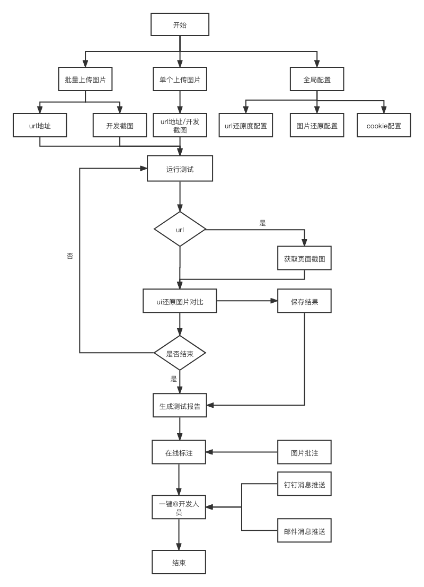

# eTest 浅谈 UI 还原性测试

UI 还原性测试其实就是对页面还原度的测试，C 端项目比较注重用户体验，对开发者的要求就比较高了，在与后端调试接口之前会对页面做还原度测试，主要是对比设计稿与开发者的页面，单纯的肉眼比较还是比较费劲的，而且沟通成本也就比较高，造成了不必要的沟通成本。那么市面上有相关的 UI 还原度测试工具吗？我们进行了深度调研发现一款[backstopjs](https://www.npmjs.com/package/backstopjs)，但是配置比较复杂，上手成本比较高， 对于 GUI 还原测试工具就没找到了， [eTest 测试工具](https://onepiece-smile.github.io/docs/#/)又怎么能做到 UI 还原性测试而不需要代码的呢？

## 设计思路

对于 UI 还原性测试，其实就是基于两张图片的差异比对，找出不同的地方，原理很简单，怎么实现设计图和页面 的比较呢？backstopjs 的实现思路的方式是通过设置打开网页的尺寸截图，然后与设计稿对比再生成一张差异图，然后通过不同的颜色标识出来。对于大项目页面较多，且页面尺寸不同时，配置比较复杂度就会上升，而且上手成本比较高。

### UI 还原性测试流程图

[eTest 测试工具](https://onepiece-smile.github.io/docs/#/)的 UI 还原性测试，有三种模式配置方式，通过批量上传图片，或者单个配置，多角度简化操作流程；对于一些页面需要登录才能获取到的,可以通过高级配置，设置登录所需的 token、cookie、header 信息等，在运行 ui 测试时，塞进请求头中；对于一些特殊的页面可能也无法通过以上两种方式实现，我们可以手动截图，只需保证截图与 UI 设计稿尺寸保持一致，也可以通过批量上传图片，通过图片对比实现 UI 比对。

但仅仅实现图片差异的对比，其实还是不够完善，对于 UI 设计师来讲，实现的差异的对比是无法满足他们的需求，所以我们又添加了在线标注的功能，通过对差异图的二次标注满足开发需求，设计师只需要在线标注完毕，就可以发给对应的开发了，大大解放设计师的标注时间成本。

UI 还原性测试对前端开发者页面还原度的要求就比较高了，一个像素的差异，颜色的差异，字体的差异，都会影响到还原性的结果，然而本身做为一个前端开发者，开发了折磨一套还原性测试，其实是在给自己挖坑，以后见到同行，请手下留情。

请大家持续关注 [eTest 测试工具](https://onepiece-smile.github.io/docs/#/)，我们会持续分享 eTest 的每一次成长，以及后续的版本迭代计划，如果大家有好的意见与建议也可以在[eTest 官网](https://onepiece-smile.github.io/docs/#/)给我们留言
